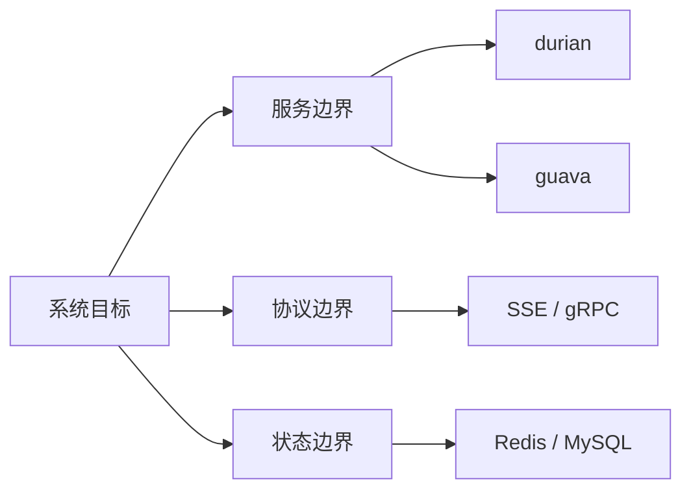
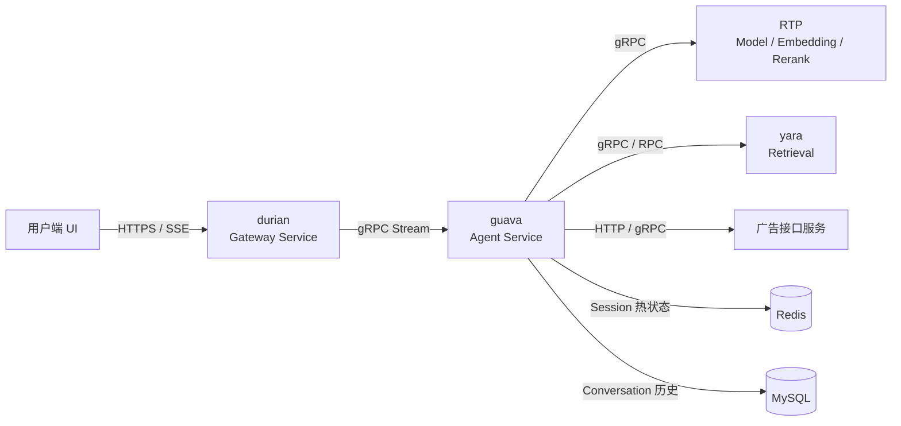
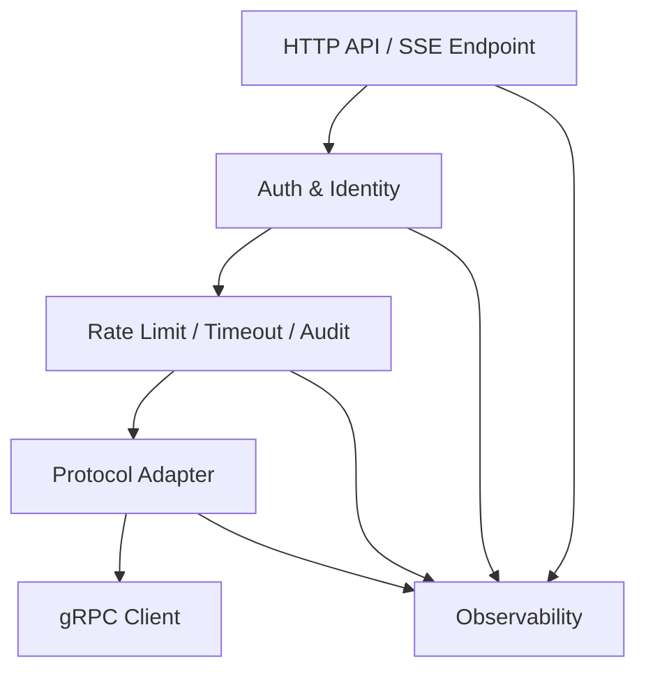
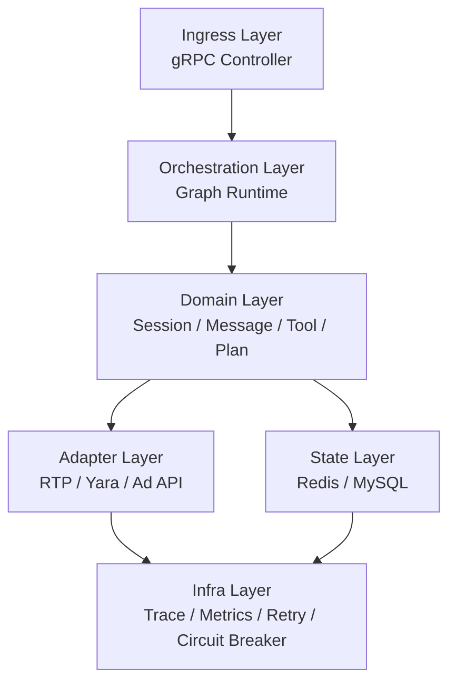
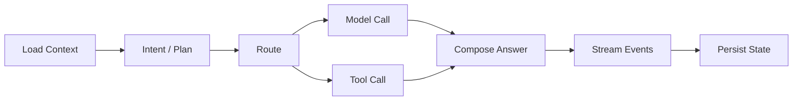
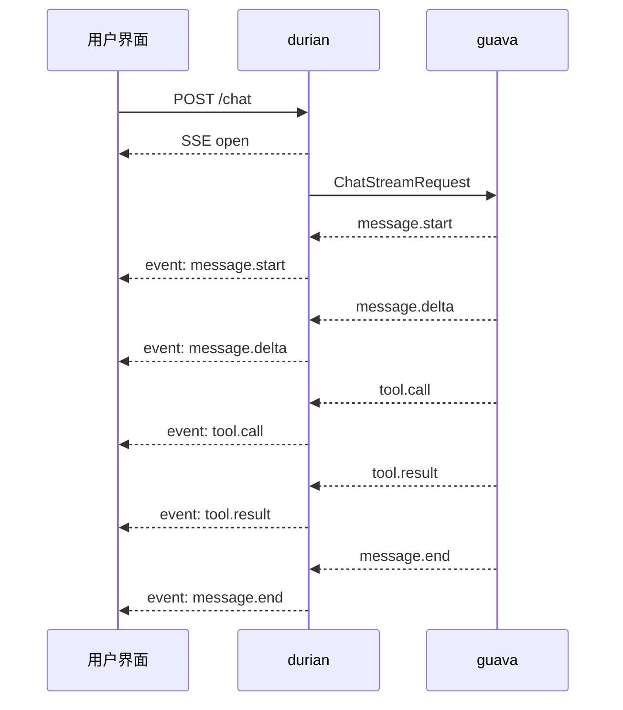
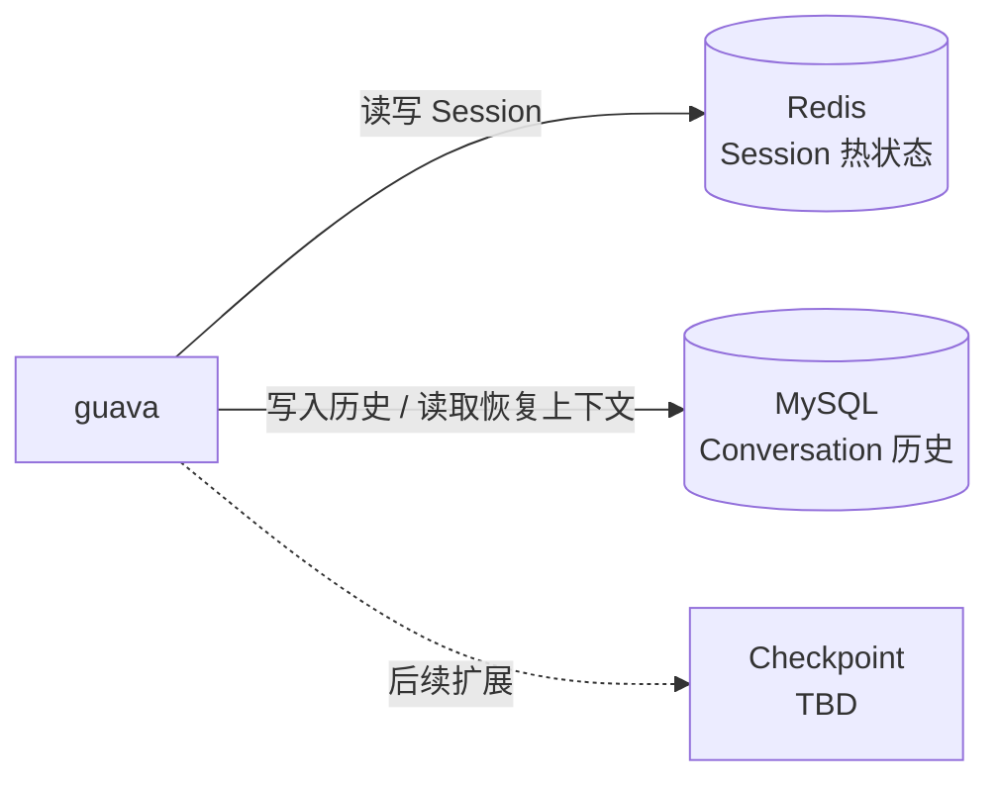
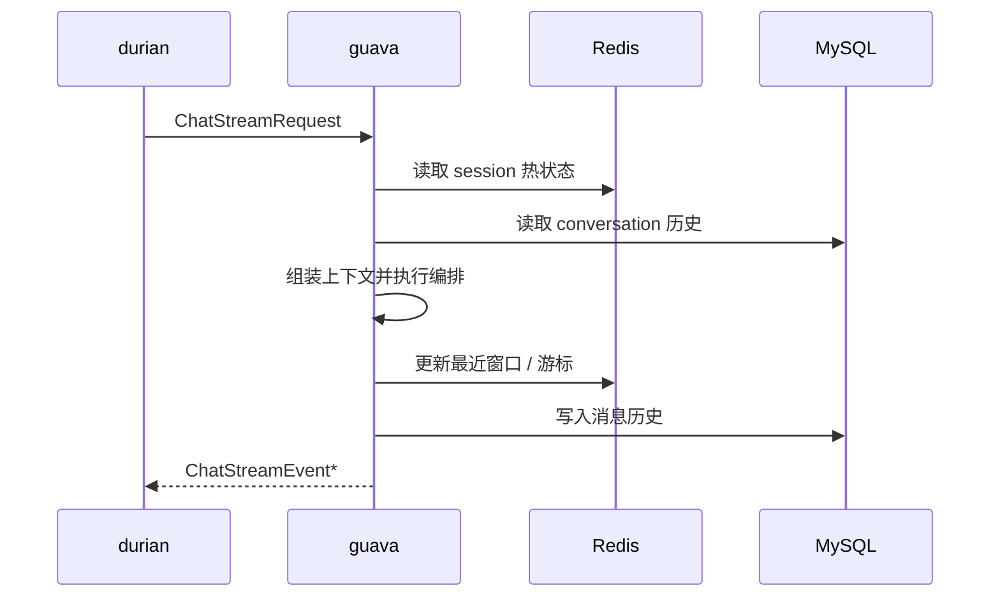
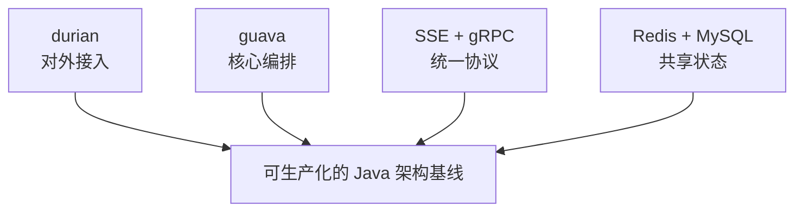

# 广告智能助手系统架构设计 V1

更新时间：2026-03-29

## 1. 文档目标

本文档用于定义广告智能助手项目第一版生产架构，作为后续工程实施、服务拆分、接口定义、存储设计和评审对齐的基础文档。

本文档默认以下前提已经成立或将按此设计推进：

- 系统拆分为两个核心服务：`durian` 与 `guava`
- 对外提供流式对话体验
- 内部主链路采用 `gRPC`
- Session 存储采用 `Redis + MySQL`
- `Checkpoint` 暂不作为本阶段立项内容，先保留为待定扩展点

本文档重点回答五个问题：

- 整体架构如何划分
- `durian` 需要承担什么职责
- `guava` 需要承担什么职责
- 协议如何交互与分层
- Session 应如何存储与管理

## 2. 整体架构

### 2.1 架构目标

第一版架构需要同时满足以下目标：

- 面向 B 端广告场景提供规则问答、指标查询、投放诊断等能力
- 支持多轮对话、流式返回、工具调用与上下文恢复
- 支持多实例部署、无状态扩缩容与故障切换
- 支持与 `RTP`、`yara`、广告接口服务稳定集成
- 为后续增加更多 Agent 能力、更多工具和更多渠道保留扩展空间

### 2.2 总体设计结论

系统采用“接入网关 + 核心 Agent 服务 + 外部依赖 + 共享状态层”的四段式架构：

- `durian` 负责统一接入与协议转换
- `guava` 负责对话理解、编排执行、工具调用和状态管理
- 外部依赖提供模型、检索和广告数据能力
- 共享状态层承载会话热状态与长期消息历史

### 2.3 总体架构图

### 2.4 分层职责说明

整个系统第一版建议按以下层次理解：

- 用户交互层：Web UI、控制台、前端 SDK
- 接入网关层：`durian`
- 业务编排层：`guava`
- 外部能力层：`RTP`、`yara`、广告接口服务
- 共享存储层：`Redis`、`MySQL`
- 治理与观测层：鉴权、限流、日志、指标、trace、审计

### 2.5 关键设计原则

- 服务实例尽量无状态
- 业务状态外置，不依赖单机内存
- 流式协议与内部协议语义统一
- 编排逻辑与底层依赖解耦
- 会话热状态与长期历史拆分存储
- 先做结构化协议和工程治理，再做平台化抽象

## 3. Durian 服务

### 3.1 服务定位

`durian` 是系统唯一对外的对话接入服务，承担网关和协议适配职责。它不是业务编排服务，也不应沉淀与 Agent 逻辑强耦合的业务规则。

### 3.2 核心职责

- 接收来自前端的 HTTP 请求
- 输出 `SSE / Streamable HTTP` 流式响应
- 承担统一鉴权与身份解析
- 进行租户、用户、设备等上下文注入
- 执行限流、超时、基础审计和请求头清洗
- 将外部请求转换为内部 `gRPC stream`
- 将 `guava` 返回的内部事件转换为前端可消费的 UI 事件

### 3.3 不承担的职责

- 不负责 Agent 编排
- 不负责工具选择与调用
- 不负责持久化完整业务 Session
- 不负责 Conversation 历史管理
- 不负责执行恢复逻辑

### 3.4 服务内部建议分层

- `API Layer`：HTTP 接口、SSE 输出
- `Auth Layer`：鉴权、身份映射、租户上下文
- `Gateway Runtime`：请求生命周期、超时、取消、限流
- `Protocol Adapter`：HTTP JSON/SSE 与 gRPC Event 互转
- `Observability`：网关日志、trace、审计埋点

### 3.5 Durian 服务架构图

### 3.6 Durian 需要提供的功能

| 功能 | 说明 |
| --- | --- |
| 会话入口 | 接收用户对话请求，生成或透传请求级上下文 |
| 流式回传 | 将内部事件流转成 SSE 事件，回传给前端 |
| 身份透传 | 将鉴权结果转换为可信的 `userId`、`tenantId`、`scopes` |
| 统一治理 | 限流、超时、错误映射、请求级审计 |
| 协议转换 | HTTP/SSE 与 gRPC stream 的双向转换 |
| UI 事件适配 | 把内部 `tool_call`、`tool_result`、`message_delta` 转换为 UI 层事件 |

### 3.7 技术实现建议

- 基础框架：`Spring Boot 3.x`
- 接口协议：HTTP + `text/event-stream`
- 内部调用：`gRPC Stub`
- 网关治理：统一 Filter / Interceptor 机制
- 观测体系：`OpenTelemetry`

## 4. Guava 服务

### 4.1 服务定位

`guava` 是整个系统的核心 Agent 服务，是对话链路的业务中枢。它负责理解请求、拼装上下文、做编排决策、调用模型与工具，并流式输出结构化结果。

### 4.2 核心职责

- 接收 `durian` 转发的对话请求
- 读取和组装 Session / Conversation 上下文
- 进行意图识别、规划、路由和执行
- 调用 `RTP`、`yara`、广告接口服务等下游依赖
- 聚合工具结果并生成最终回复
- 流式输出事件，并持久化消息历史
- 维护 Session 热状态与恢复游标

### 4.3 不承担的职责

- 不直接暴露对外 HTTP 对话入口
- 不承担登录态鉴权
- 不依赖前端协议细节
- 不在本地内存中持久化会话事实源

### 4.4 Guava 服务分层

建议 `guava` 采用如下六层结构：

- 接入层：gRPC 接口、请求校验、幂等处理
- 编排层：Graph Runtime / Workflow Engine
- 领域层：消息、会话、工具、检索、规划等领域对象
- 适配层：`RTP`、`yara`、广告接口服务适配器
- 状态层：`SessionStore`、`ConversationStore`
- 基础设施层：日志、trace、配置、重试、熔断、指标

### 4.5 Guava 服务架构图

### 4.6 Guava 需要提供的功能

| 功能 | 说明 |
| --- | --- |
| 对话编排 | 承载主对话链路的节点执行与状态流转 |
| 上下文管理 | 加载最近窗口、拼接历史、执行裁剪与摘要 |
| 模型调用 | 统一模型生成、函数调用、重排、Embedding 调用入口 |
| 工具调用 | 广告指标、规则知识、诊断能力等工具执行 |
| 检索增强 | 通过 `yara` 完成知识检索、召回与重排 |
| 事件输出 | 按统一事件模型流式返回结果 |
| 状态持久化 | 持久化 Session 热状态和 Conversation 历史 |
| 故障治理 | 超时、重试、熔断、兜底与错误映射 |

### 4.7 技术实现建议

- 基础框架：`Spring Boot 3.x`
- 服务接口：`gRPC`
- 编排实现：
  - 优先方案：`LangGraph4j` 或兼容图编排心智的运行时
  - 兜底方案：基于节点接口的手动状态机
- 存储访问：Repository + Store 抽象
- 下游适配：Adapter 模式
- 可观测：`OpenTelemetry + Metrics`

### 4.8 Guava 编排运行图

## 5. 协议交互

### 5.1 协议分层

第一版协议明确分成三层：

- 对外协议：用户 UI 与 `durian` 之间
- 主链路协议：`durian` 与 `guava` 之间
- 下游能力协议：`guava` 与外部依赖之间

### 5.2 协议选型结论

| 交互链路 | 选型 | 结论原因 |
| --- | --- | --- |
| 用户 UI -> durian | HTTP + SSE | 浏览器友好、流式体验直接、接入成本低 |
| durian -> guava | gRPC Streaming | 强类型、性能稳定、适合内部流式事件 |
| guava -> RTP | gRPC | 适合结构化请求、低开销和流式能力 |
| guava -> yara | gRPC / RPC | 与内部检索服务集成自然、便于统一治理 |
| guava -> 广告接口服务 | HTTP 或 gRPC | 兼容既有接口形态，逐步收敛到统一适配层 |

### 5.3 协议选型横向比较

| 维度 | HTTP + SSE | gRPC Streaming | WebSocket |
| --- | --- | --- | --- |
| 浏览器原生支持 | 高 | 低 | 中 |
| 服务间强类型约束 | 低 | 高 | 低 |
| 流式输出能力 | 高 | 高 | 高 |
| 调试与接入成本 | 低 | 中 | 中 |
| 适合作为内部主链路 | 中 | 高 | 低 |
| 适合作为对外交互协议 | 高 | 低 | 中 |
| 第一版结论 | 对外采用 | 内部采用 | 暂不采用 |

### 5.4 UI 交互图

### 5.5 协议事件模型

第一版建议采用事件流模型，而不是只返回纯文本 token。核心事件建议包括：

- `message.start`
- `message.delta`
- `tool.call`
- `tool.result`
- `message.end`
- `error`

### 5.6 协议对象建议

第一版主链路建议统一以下对象：

- `ChatStreamRequest`
- `ChatStreamEvent`
- `RequestHeader`
- `ChatSessionContext`
- `ChatMessage`
- `ToolCallPayload`
- `ToolResultPayload`

### 5.7 协议设计原则

- 外部和内部的事件语义保持一致
- `traceId`、`requestId`、`sessionId`、`conversationId` 分离建模
- UI 层只感知事件，不感知内部 gRPC 细节
- 下游依赖通过 Adapter 隔离，避免业务编排耦合具体协议

## 6. Session 存储

### 6.1 设计结论

Session 存储采用双层设计：

- `Redis`：保存会话热状态
- `MySQL`：保存 Conversation 历史与元数据

`Checkpoint` 暂不纳入第一版范围，但在模型和存储设计上保留扩展位。

### 6.2 状态边界

第一版建议将状态拆成两类：

- `Session`：短周期、高频访问、可过期的热状态
- `Conversation`：长期保存、可审计、可恢复的消息历史

### 6.3 Redis 存储内容

Redis 主要用于承载热状态：

- `sessionId` 对应的会话元信息
- 最近 N 轮消息窗口
- 当前活跃会话的恢复游标
- 请求幂等键
- 热点用户短期画像

### 6.4 MySQL 存储内容

MySQL 主要用于承载长期事实：

- 完整消息历史
- 会话与对话元数据
- 审计字段
- 长期画像或业务偏好

### 6.5 Session 存储图

### 6.6 Session 管理时序图

### 6.7 Redis 与 MySQL 的横向比较

| 维度 | Redis | MySQL |
| --- | --- | --- |
| 数据定位 | 热状态 | 长期事实 |
| 读写延迟 | 低 | 中 |
| TTL 支持 | 强 | 弱 |
| 高频随机访问 | 强 | 中 |
| 复杂查询能力 | 弱 | 强 |
| 审计与离线分析 | 弱 | 强 |
| 适合内容 | 最近窗口、游标、幂等键 | 历史消息、元数据、审计 |
| 第一版结论 | 必选 | 必选 |

### 6.8 为什么不把 Checkpoint 纳入第一版

第一版目标是先把主对话链路、协议结构和 Session 存储做稳。`Checkpoint` 虽然长期重要，但如果在当前阶段立项，容易把问题从“聊天系统工程化”提前扩大成“通用工作流恢复引擎”。

因此本阶段建议：

- 协议中保留 `executionId`、`resume_event_id` 等扩展字段
- 数据模型中保留可扩展位置
- 不单独建设完整的 `Checkpoint Store`

## 7. 选型与原因

### 7.1 第一版已定选型

| 模块 | 选型 | 原因 |
| --- | --- | --- |
| 对外网关 | `durian` 独立服务 | 统一接入、隔离对外协议与业务编排 |
| 核心 Agent | `guava` 独立服务 | 聚焦业务编排与能力聚合 |
| 对外流式协议 | `SSE` | 浏览器天然支持、前端接入简单 |
| 内部主链路 | `gRPC Streaming` | 类型清晰、事件建模自然、适合内部服务通信 |
| 应用框架 | `Spring Boot 3.x` | Java 团队成熟、生态完善、工程效率高 |
| 编排运行时 | `LangGraph4j` 优先 | 与现有 MVP 心智接近，易于承接多 Agent 编排 |
| Session 热状态 | `Redis` | 低延迟、TTL 与共享会话能力成熟 |
| Conversation 历史 | `MySQL` | 查询与治理能力成熟，便于审计和恢复 |
| 检索能力 | 复用 `yara` | 降低重复建设，承接现有能力 |

### 7.2 编排方案横向比较

| 方案 | 优点 | 缺点 | 第一版建议 |
| --- | --- | --- | --- |
| LangGraph4j | 贴近 MVP 心智，适合多节点编排 | 学习成本略高，生态仍在发展 | 优先采用 |
| 手动状态机 | 最直接、可控、依赖少 | 扩展后容易失控，编排可读性弱 | 兜底方案 |
| 通用 DAG 框架 | 调度能力强 | 对对话式状态流未必天然匹配 | 暂不优先 |

### 7.3 对外流式协议横向比较

| 方案 | 优点 | 缺点 | 第一版建议 |
| --- | --- | --- | --- |
| SSE | 浏览器友好、实现轻、适合单向流式输出 | 双向能力弱 | 采用 |
| WebSocket | 双向能力强 | 网关、心跳、连接治理复杂 | 暂不采用 |
| 轮询 / 长轮询 | 实现简单 | 体验差、效率低 | 不采用 |

### 7.4 Session 存储横向比较

| 方案 | 优点 | 缺点 | 第一版建议 |
| --- | --- | --- | --- |
| Redis only | 简单、低延迟 | 历史治理和审计弱 | 不采用 |
| MySQL only | 事实源统一 | 热状态读写不优 | 不采用 |
| Redis + MySQL | 同时满足热状态与长历史 | 架构略复杂 | 采用 |

## 8. 第一版架构落地范围

### 8.1 纳入范围

- `durian` 网关服务
- `guava` Agent 核心服务
- `SSE + gRPC` 主链路协议
- `Redis + MySQL` Session 存储
- 基础限流、超时、日志、trace
- 与 `RTP`、`yara`、广告接口服务的基础集成

### 8.2 暂不纳入范围

- 独立 `Checkpoint Store`
- 可视化 DSL 编排平台
- 通用插件市场
- 多 Region 全局一致性方案
- 通用化 Agent 平台能力

## 9. 架构结论

第一版架构的核心是把系统清晰拆成“接入”和“编排”两部分：

- `durian` 作为统一对外接入和协议转换层
- `guava` 作为核心 Agent 业务中枢
- 通过 `SSE + gRPC` 串起对外与对内交互
- 通过 `Redis + MySQL` 承载 Session 与 Conversation

这套设计的目标不是一次性做成完整平台，而是在现有 MVP 基础上建立一套可以生产化、可以运维、可以继续演进的 Java 架构基线。

