# 广告智能助手 Java 工程落地汇报 V1

更新时间：2026-03-29

## 1. 汇报目标与结论

本次汇报的目标，是在现有 MVP 已经验证业务价值的前提下，给出一版适合 Java 工程落地的整体框架。重点回答四个问题：

- 整个系统应该如何拆分服务边界
- `guava` 作为核心 Agent 服务，应如何分层
- 协议层需要定义哪些协议、如何统一事件模型
- 数据存储与 Session 管理应如何设计

第一版核心结论如下：

- 系统拆分为两个核心服务：`durian` 网关服务、`guava` Agent 核心服务
- `durian` 负责外部接入、鉴权、限流、SSE 输出、协议转换，不承载业务编排
- `guava` 负责会话组装、Agent 编排、模型调用、工具调用、结果流式输出，是业务中枢
- `guava` 实例应保持无状态，业务状态外置
- 协议应分三层设计：外部 SSE 协议、内部 gRPC 流协议、下游能力 RPC 协议
- Session 采用“热状态 + 长历史 + 执行断点”三层拆分，而不是一个大对象

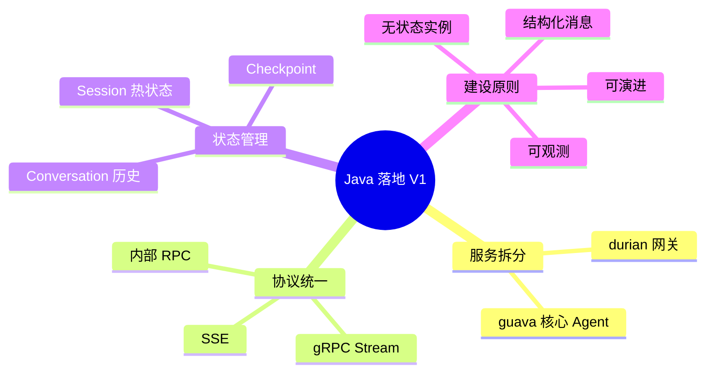

## 2. 项目背景与建设目标

当前项目已经具备一个由算法团队实现的 MVP，多 Agent 编排能力已基本验证。下一阶段不是继续做 Demo，而是将能力沉淀为一套可运维、可扩展、可演进的 Java 工程系统。

这意味着第一版架构必须同时满足以下目标：

- 面向 B 端广告场景，承接规则问答、指标查询、投放诊断等能力
- 对接既有的 `RTP` 服务、`yara`、广告接口服务
- 支持流式回答、多轮对话、工具调用和上下文恢复
- 支持多实例部署、故障切换、容量扩展和链路观测
- 为后续 Agent 扩容、协议扩展、工具增加保留演进空间

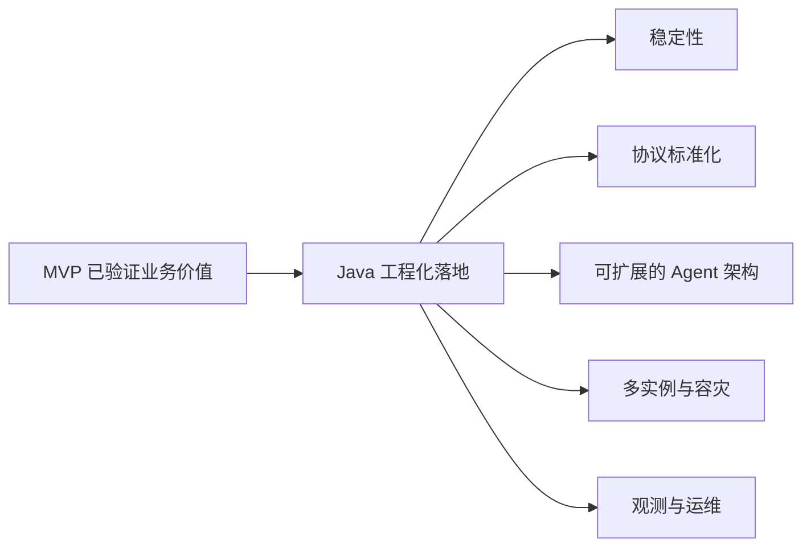

## 3. 总体系统架构

系统第一版建议围绕 `durian + guava` 进行双服务拆分。

### 3.1 `durian` 的职责

- 对接用户侧 Web / App / 控制台
- 负责登录态鉴权、租户识别、限流、审计前置校验
- 对外输出 `SSE / Streamable HTTP`
- 将外部请求转换为内部 `gRPC stream`
- 注入并透传 `trace`、`requestId`、`userId`、`tenantId`

### 3.2 `guava` 的职责

- 负责对话主链路编排
- 负责上下文装配、意图识别、工具规划与执行
- 负责调用 `RTP`、`yara`、广告接口服务等依赖
- 负责流式事件生产、消息持久化、Checkpoint 记录

### 3.3 外围依赖

- `RTP`：模型、Embedding、重排等能力
- `yara`：向量检索或知识检索能力
- 广告接口服务：广告账户、计划、报表、诊断数据
- 存储层：Redis / MySQL / 对象存储

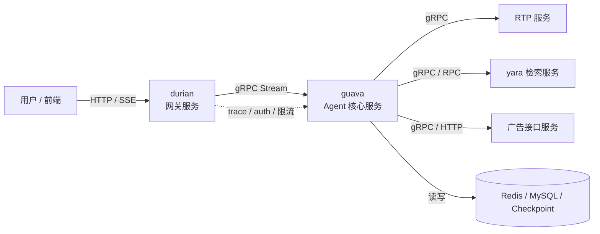

## 4. 关键交互链路

从用户视角看，整个主链路可以概括为：请求接入、协议转换、上下文恢复、Agent 编排、工具执行、流式回传、状态落库。

这条链路里，`durian` 解决的是“接进来”和“发出去”的问题，`guava` 解决的是“怎么理解、怎么执行、怎么恢复”的问题。

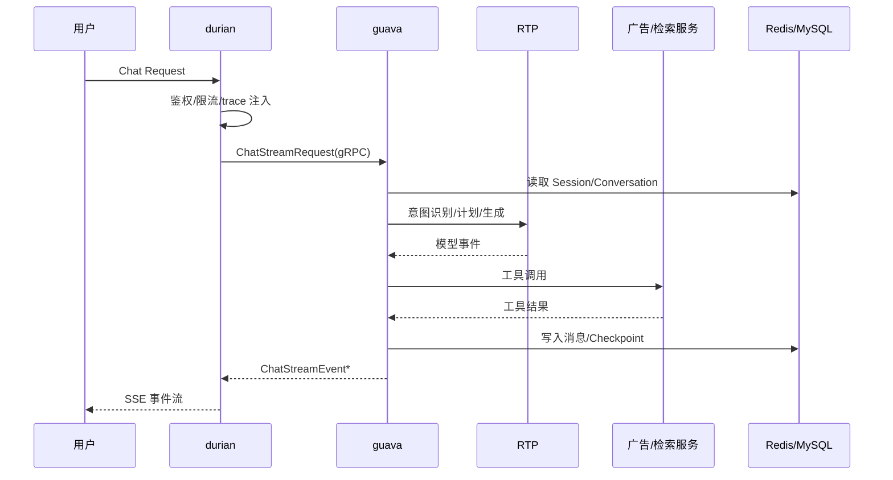

## 5. `guava` 自身架构分层

`guava` 不建议直接做成“Controller + 一堆 RPC 调用”的平铺式服务，而应分层设计，避免后续工具、模型、节点一多就失控。

建议第一版至少拆成六层：

- 接入层：接收 `ChatStreamRequest`，做参数校验、幂等与基础上下文构建
- 编排层：负责编排图、节点调度、状态流转、执行生命周期
- 领域层：沉淀会话、消息、工具调用、检索、诊断等核心领域对象
- 适配层：统一接入 `RTP`、`yara`、广告接口服务
- 状态层：负责 Session、Conversation、Checkpoint 的读写
- 基础设施层：日志、追踪、配置、限流、重试、熔断、审计

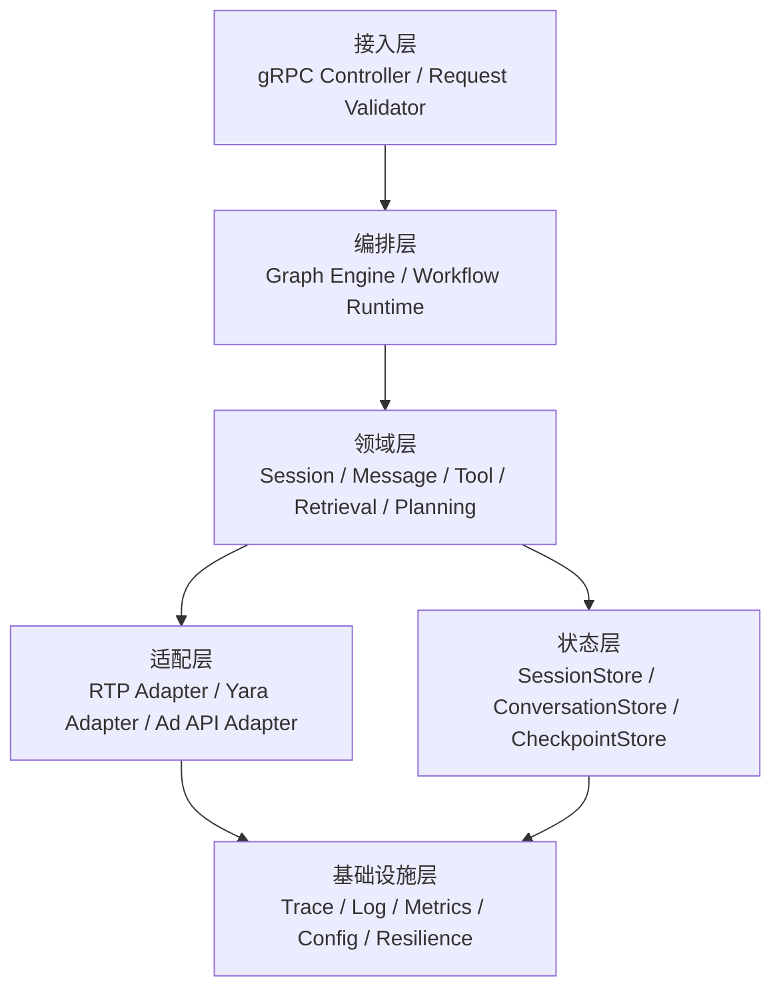

## 6. `guava` 的核心功能模块

从业务能力角度看，`guava` 第一版需要覆盖的模块不一定很多，但边界必须清晰。建议聚焦在以下模块：

- `Chat Runtime`：请求生命周期管理、流式输出、取消与超时控制
- `Context Manager`：会话窗口加载、上下文裁剪、摘要压缩、记忆拼装
- `Planner / Router`：意图识别、能力选择、节点路由
- `Tool Execution`：广告报表、规则知识、诊断工具等能力接入
- `Model Gateway`：统一承接模型生成、函数调用、重排、Embedding 请求
- `Persistence`：消息历史、状态快照、执行断点保存
- `Observability`：日志、指标、trace、审计和问题定位

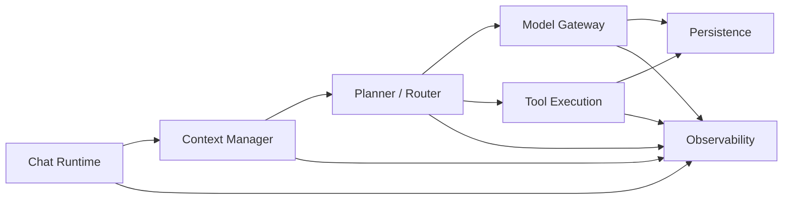

## 7. 技术选型建议

第一版技术选型建议遵循一个原则：优先选择 Java 团队容易维护、能快速落地、且具备后续演进空间的方案。

建议如下：

- 应用框架：`Spring Boot 3.x`
- 服务协议：内部主链路使用 `gRPC`
- 对外流式协议：`SSE / Streamable HTTP`
- 编排实现：
  - 主方案：`LangGraph4j` 或贴近 LangGraph 心智的图编排抽象
  - 兜底方案：手动状态机 + Node 接口
- 缓存与热状态：`Redis / Valkey`
- 历史存储：`MySQL` 优先
- 向量检索：优先复用 `yara`
- 可观测：`OpenTelemetry + Prometheus + 日志平台`
- 容错治理：`resilience4j` 或同类能力

这一版不建议把重点放在自研 DSL、可视化编排平台或全量工作流平台化上。第一版真正应该先做实的是：协议、对象模型、状态边界、观测能力。

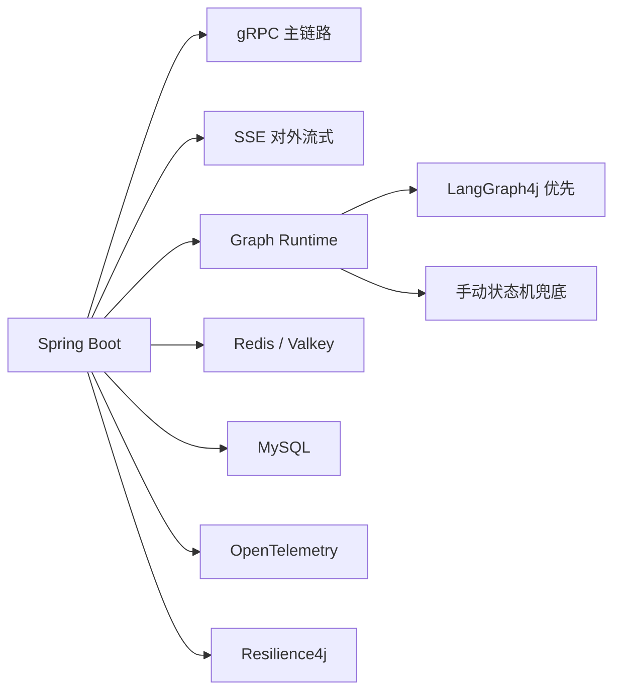

## 8. 协议层总体设计

协议层是第一版最需要优先收敛的部分。建议明确区分三层协议，而不是让每一层都直接暴露底层实现细节。

### 8.1 外部协议

用户到 `durian`：HTTP JSON 请求 + `SSE` 响应。

### 8.2 内部主链路协议

`durian` 到 `guava`：`gRPC streaming`，事件语义与 SSE 尽量保持一致。

### 8.3 下游能力协议

`guava` 到 `RTP / yara / 广告接口服务`：使用 `gRPC / RPC`，但建议统一公共 envelope，避免每个服务都定义一套完全不同的头部和上下文。

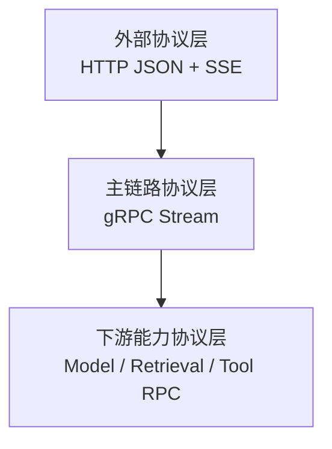

## 9. 第一版需要定义的核心协议

第一版不需要把所有协议一次性做复杂，但以下协议必须明确：

### 9.1 对话请求与流式事件协议

建议统一定义：

- `ChatStreamRequest`
- `ChatStreamEvent`
- `RequestHeader`
- `ChatSessionContext`
- `ChatOptions`

### 9.2 消息协议

建议统一定义结构化消息，而不是仅传 `List<String>`：

- `ChatMessage`
- `MessagePart`
- `MessageRole`
- `MessageType`

### 9.3 工具调用协议

- `ToolDescriptor`
- `ToolCallPayload`
- `ToolResultPayload`
- `ToolResultStatus`

### 9.4 执行与恢复协议

- `EventHeader`
- `CheckpointEvent`
- `resume_event_id`
- `execution_id`

### 9.5 错误与警告协议

- `ErrorEvent`
- `WarningEvent`
- 标准错误码
- 是否可重试、何时重试

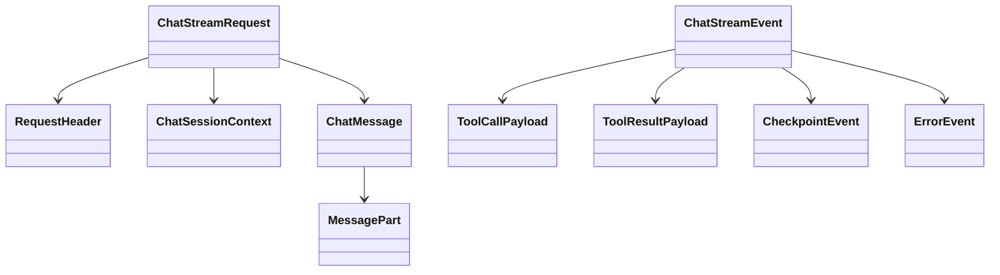

## 10. 协议设计的关键原则

协议设计不只是“字段定义”，更重要的是定义边界和约束。第一版建议遵循以下原则：

- 事件流优先，不只传 token
- 结构化消息优先，不依赖自由文本拼接
- 业务标识分离：`requestId`、`traceId`、`sessionId`、`conversationId`、`executionId` 各司其职
- 协议语义统一：SSE 和 gRPC 传输层不同，但事件语义尽量一致
- 对下游采用统一 envelope，减少对具体厂商协议的耦合
- 保留扩展字段，但热点结构优先强类型化

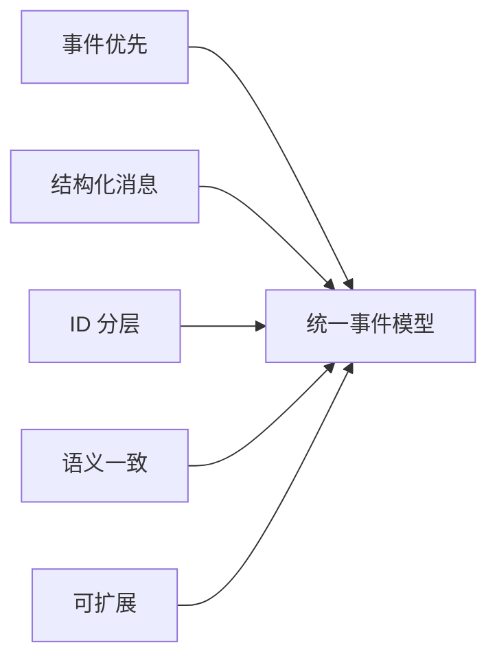

## 11. 数据存储架构

第一版建议不要用单一存储承载全部状态，而是按生命周期和访问模式拆分。

### 11.1 Redis / Valkey

适合存放：

- Session 热状态
- 最近对话窗口
- 幂等键
- SSE / 流式 cursor
- 热 Checkpoint

### 11.2 MySQL

适合存放：

- 完整 Conversation History
- 消息元数据
- 审计记录
- 长期用户偏好和业务画像

### 11.3 Checkpoint 存储

适合存放：

- 执行断点
- 当前节点状态
- 工具调用中间结果引用
- 恢复所需的状态快照

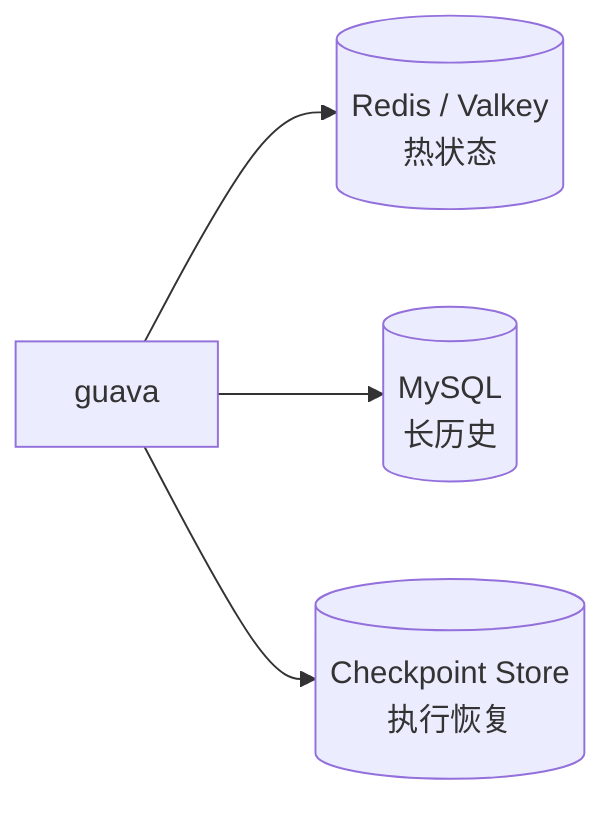

## 12. Session 管理方案

Session 管理是整个系统成败的关键之一。建议采用：

`无状态 guava 实例 + Redis 共享 Session + MySQL Conversation + 独立 Checkpoint`

### 12.1 为什么不能只用本地内存

- 多实例部署下无法共享上下文
- 实例故障会导致会话丢失
- SSE 重连可能落到其他实例

### 12.2 Session 应保存什么

- 当前会话元信息
- 最近 N 轮上下文窗口
- 当前活跃执行信息
- 流式恢复游标
- 短期个性化特征

### 12.3 Session 不应保存什么

- 完整历史消息
- 原始 token
- 全量长期记忆
- 复杂执行快照明细

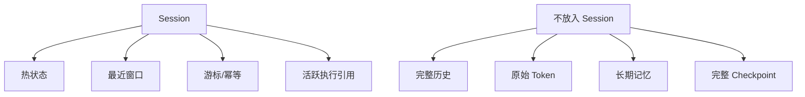

## 13. Session、Conversation、Execution 三者关系

建议从一开始就把几个 ID 的关系定义清楚，否则后续排障、恢复、审计都会很痛苦。

- 一个 `userId` 可以拥有多个 `sessionId`
- 一个 `sessionId` 可以承载多个 `conversationId`
- 一个 `conversationId` 会产生多次 `executionId`
- 一个 `executionId` 过程中会产生多个 `eventId`

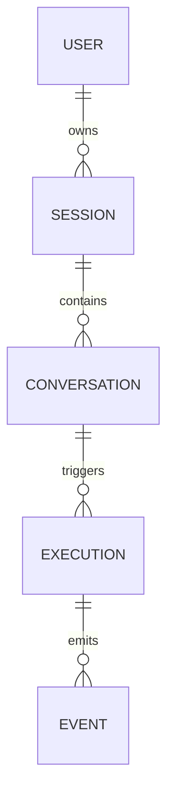

## 14. 流式恢复与 Session 时序

流式系统里，连接和会话是两回事。SSE 连接断开不应等于业务会话丢失。恢复应依赖 `resume_event_id`、共享 Session 和持久化事件。

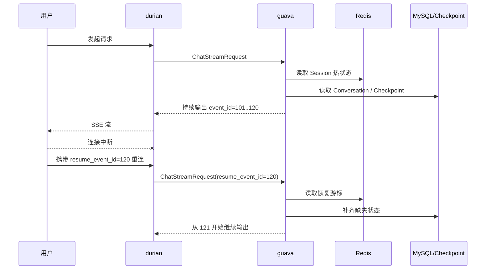

## 15. 稳定性与工程治理要求

第一版虽然是 V1，但不能只关注“能跑通”，还要把系统性风险控制住。建议在设计里同步纳入以下能力：

- 限流：按租户、用户、会话维度限流
- 超时：模型调用、工具调用、整链路超时分级控制
- 重试：仅对幂等且明确可重试的下游能力重试
- 熔断与隔离：广告接口、检索接口、模型接口分开治理
- 审计：记录关键请求、工具调用、异常和恢复路径
- 可观测：日志、指标、trace、事件序列统一关联

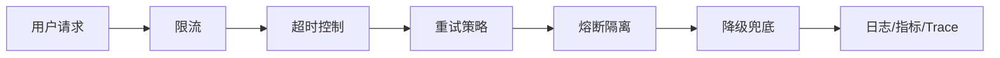

## 16. 第一版实施优先级建议

为了降低落地风险，建议分三个阶段推进。

### 第一阶段：主链路打通

- 落地 `durian -> guava` 的 gRPC 流式协议
- 定义 `ChatStreamRequest / Event / Message / Tool` 协议
- 打通 Session 热状态与 Conversation 历史

### 第二阶段：工程化补齐

- 完善 Checkpoint、幂等、恢复、限流、审计
- 接入指标、日志、链路追踪
- 对工具调用增加超时、重试、熔断

### 第三阶段：平台化演进

- 抽象更稳定的节点框架
- 支持更多 Agent 能力与工具编排
- 评估 DSL、可视化编排、统一插件机制

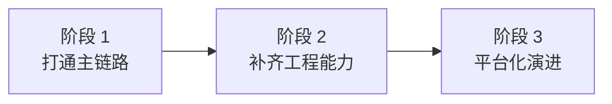

## 17. 当前建议的汇报结论

第一版建议可以收敛为以下一句话：

**以 `durian` 作为统一接入与协议转换网关，以 `guava` 作为无状态 Agent 业务中枢，通过统一事件协议、分层状态存储和可恢复 Session 机制，把 MVP 升级为可生产部署的 Java 架构。**

本阶段最应该优先拍板的，不是 DSL 或平台化形式，而是以下四件事：

- 两个服务的职责边界
- 主链路协议与事件模型
- Session / Conversation / Checkpoint 的存储边界
- 第一版的工程选型与治理要求

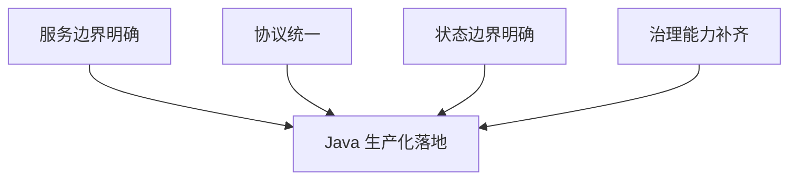

